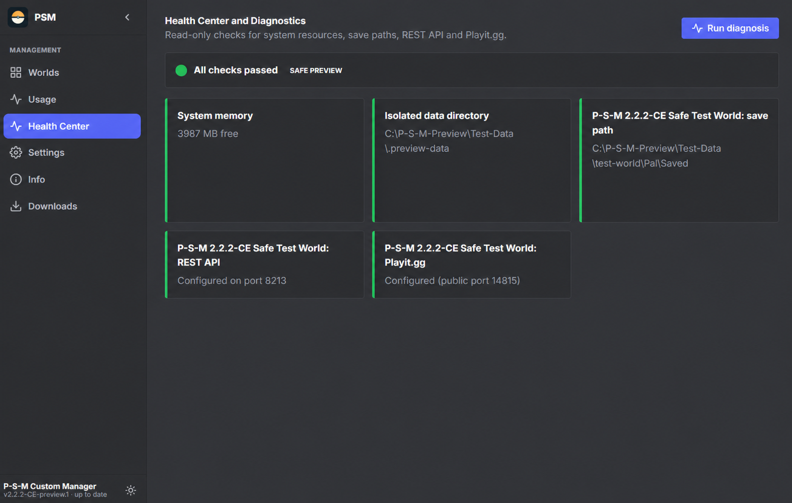
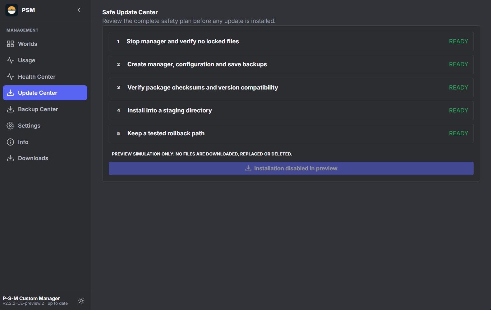
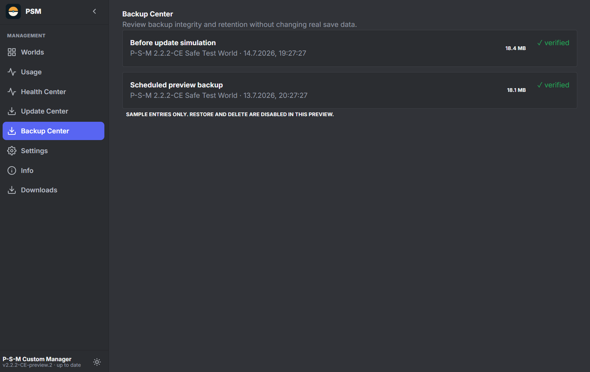
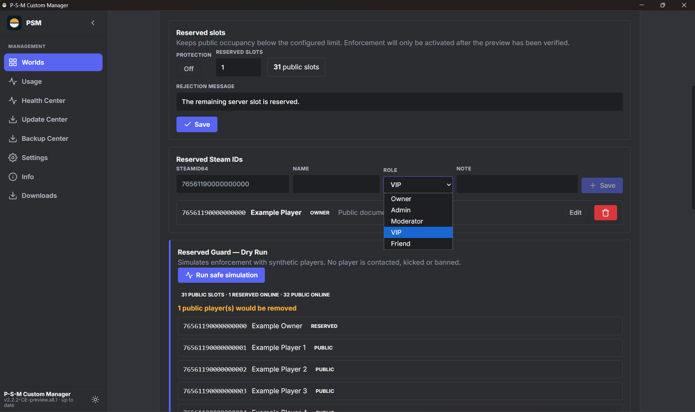

# Palworld Server Manager Custom Edition

A maintained Custom Edition of the Palworld Server Manager with upstream 2.3.0 integration and the P-S-M Custom Manager improvements from 2.2.2-CE.

This edition keeps existing worlds, manager data, schedules and settings while adding the upstream 2.3.0 features and the tested Custom Edition hotfixes.

**Original project and credits:** The Palworld Server Manager was originally created by [PrakashMandal-IV](https://github.com/PrakashMandal-IV), also credited as [**Frenzi24**](https://next.nexusmods.com/profile/Frenzi24). All original work remains attributed to its creator; this repository is a Custom Edition based on that project.

## Current release: 2.3.0-CE

Based on the official upstream release:

- https://github.com/PrakashMandal-IV/palworld-server-manager/releases/tag/v2.3.0
- https://github.com/PrakashMandal-IV/palworld-server-manager/compare/v2.2.0...v2.3.0

## Credits

The original Palworld Server Manager was created by [PrakashMandal-IV](https://github.com/PrakashMandal-IV). The original project creator and author is also credited as [**Frenzi24**](https://next.nexusmods.com/profile/Frenzi24). This Custom Edition builds on their work and keeps the upstream project attribution and GPL license.

## What's new in 2.3.0-CE

- Live player map and map calibration.
- Steam Workshop mod management with thumbnails and mod updates.
- Steam build checking and update status display.
- Scheduler support for delayed on-join messages.
- Scheduled backups only run while the world is running.
- Discord `notify_events` and backfill fixes.
- Language-pack update detection and registry refresh.
- Dynamic free local web-port selection for preview and packaged starts.
- Explorer-compatible ZIP packaging for all published Windows packages.
- The 2.2.2-CE hotfix is included: corrected Update-Center translations, no preview-disabled text in Stable, and the Electron main entrypoint is included in the application package.

## Custom Edition features

- **Reserved Slots** with the integrated **Reserved Guard - Dry Run** in the same section. Configure multiple SteamID64 entries with roles, names and notes, choose the reserved-slot count, and test the complete 32-slot logic without changing the live server.
- **Playit.gg Center** for tunnel setup and connection guidance.
- **Health Center** with diagnostics and actionable status information.
- **Safe Update Center**, **Backup Center**, and update/backup/rollback workflows.
- Full multilingual UI: English is the first-start default, German and eleven additional language packs are bundled. The current stable catalog contains 748/748 translated keys.
- P-S-M Custom Manager branding and Electron desktop packaging.
- Existing worlds and manager data remain the source of truth; no synthetic test data is shipped as real server data.

## Downloads

Download the current release from the [GitHub release page](https://github.com/schmitt627235-prog/palworld-server-manager-custom-edition/releases/tag/2.3.0-CE).

The release contains three Windows Explorer-compatible ZIP archives:

1. `2.3.0-CE-Stable-Custom-Edition-Update.zip` - update an existing Custom Edition installation.
2. `2.3.0-CE-Stable-Standalone-Installation.zip` - install the Custom Edition as a standalone package.
3. `2.3.0-CE-Stable-Official-to-CE-Update.zip` - migrate an official installation to Custom Edition.

SHA-256 checksums are included in `2.3.0-CE-SHA256SUMS.txt`. Installers and executables are unsigned; Windows SmartScreen may display a warning.

## Languages

| Language | Translation status |
|---|---:|
| English (default) | 748/748 (100%) |
| German | 748/748 (100%) |
| Spanish | 748/748 (100%) |
| French | 748/748 (100%) |
| Italian | 748/748 (100%) |
| Portuguese | 748/748 (100%) |
| Russian | 748/748 (100%) |
| Ukrainian | 748/748 (100%) |
| Polish | 748/748 (100%) |
| Turkish | 748/748 (100%) |
| Chinese | 748/748 (100%) |
| Japanese | 748/748 (100%) |
| Korean | 748/748 (100%) |

English is the primary catalog. Additional packs are machine-translated and community-reviewed where available.

## Interface reference screenshots

The repository screenshots are synthetic and contain no personal IDs, passwords, webhooks, real world paths or real world names.

## Reserved-slot limitation

Reserved slots are enforced by the manager's guard workflow and Palworld server configuration. The Dry Run validates the configured list and the complete 32-slot capacity logic without kicking players or modifying the live world.

## Installation safety

Always stop the manager and server before applying an update. Create a backup first. The update workflow preserves existing worlds, `Pal\\Saved`, manager databases, schedules and settings. Never delete or replace `Pal\\Saved` unless you have a verified backup and explicitly intend to do so.

## Development

This repository tracks the Custom Edition integration of upstream Palworld Server Manager. Changes should preserve the upstream GPL license and the Custom Edition safety, localization and packaging requirements.

## Privacy

Do not publish personal data, SteamID64 values, passwords, webhooks, real world paths or real world names. Use synthetic test data for screenshots, previews and issue reports.

## License

This project is based on and distributed under the GNU General Public License v3.0, consistent with the upstream project.
