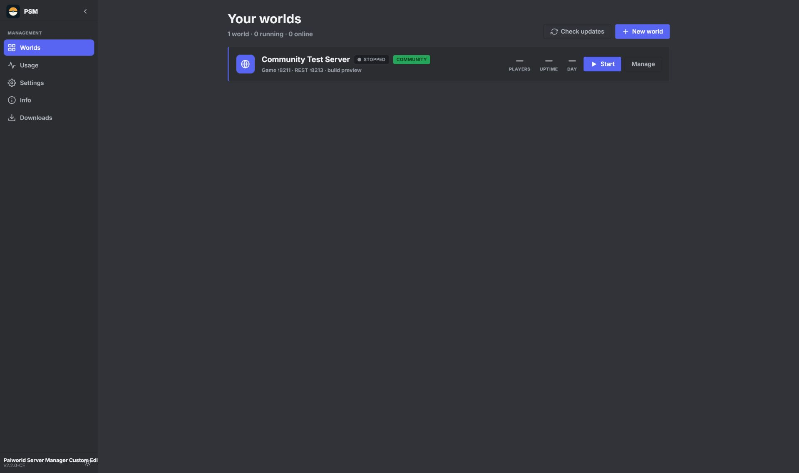
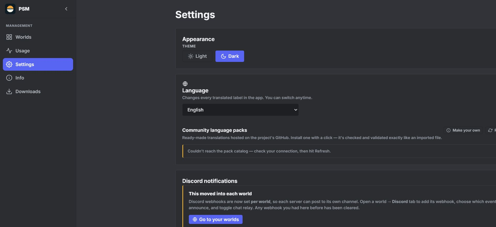
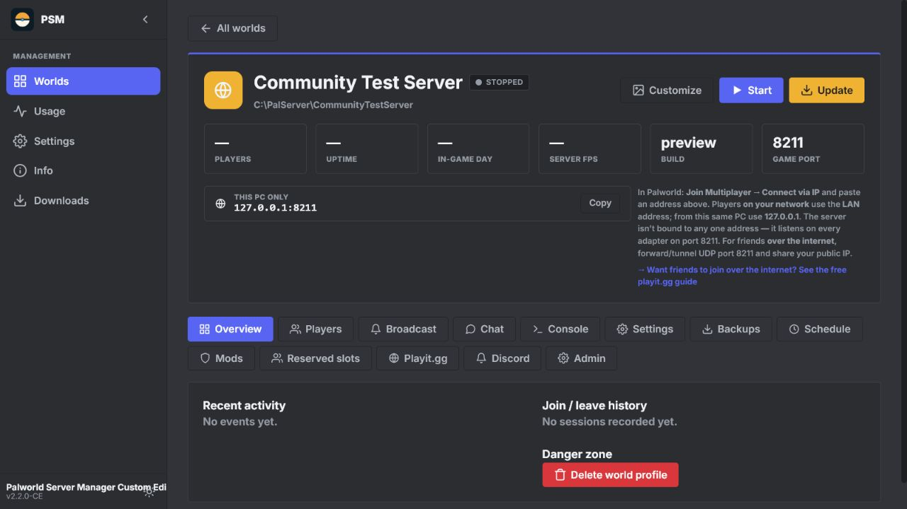
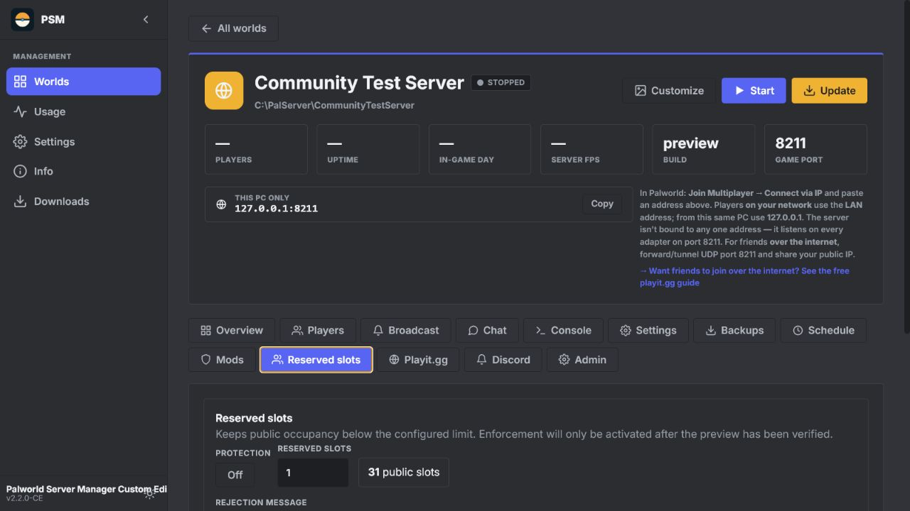
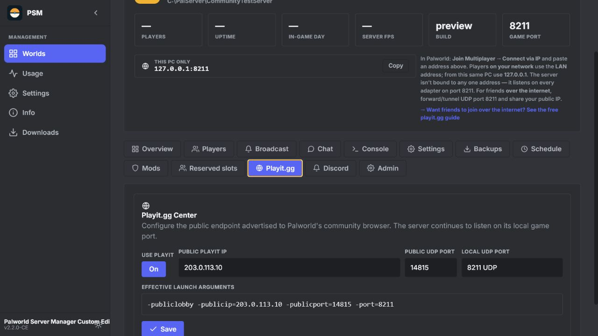

# Palworld Server Manager Custom Edition

An extended, multilingual fork of the original **Palworld Server Manager**, focused on safe operation of existing servers, reserved-slot management, Playit.gg support, and easier administration.

> **Current release:** `2.2.0-CE` — CE means **Custom Edition**.

## Credits and upstream project

This project is based on the GPL-3.0-licensed work of **PrakashMandal-IV (Frenzi24)**.

- Original GitHub project: [PrakashMandal-IV/palworld-server-manager](https://github.com/PrakashMandal-IV/palworld-server-manager)
- Original author on GitHub: [PrakashMandal-IV](https://github.com/PrakashMandal-IV)
- Original author on Nexus Mods: [Frenzi24](https://next.nexusmods.com/profile/Frenzi24)

The Custom Edition preserves the original license and does not claim ownership of the upstream project.

## Highlights in 2.2.0-CE

- **Reserved Slots** per world
  - Multiple SteamID64 entries
  - Roles: Owner, Admin, Moderator, VIP, and Friend
  - Optional display names and notes
  - Configurable reserved capacity from 1 to 31 slots
  - Reserved-player visibility in the world interface
- **Playit.gg Center**
  - Local and public port settings
  - Community-server launch configuration
  - Tunnel and connectivity diagnostics
  - Safe defaults for `-publiclobby`, public IP, and public port handling
- **Multilingual interface**
  - English is the first-launch default
  - Language can be changed under Settings
  - 13 included languages, each containing all 713 current translation keys
- **Safety and compatibility**
  - Existing official 2.1.0 installations can be upgraded with the dedicated patch
  - Automatic backup before patching
  - Existing manager data and registered worlds are retained
  - `Pal\Saved` is backed up but never supplied, replaced, or deleted by the release
  - Standalone installation uses an isolated data directory
- **Administration improvements**
  - Local system and REST API health checks
  - CPU/RAM and server status metrics
  - Improved logging, search, filters, and error highlighting
  - Existing backup, scheduler, Discord, player, console, mod, and world-management features remain available

## Downloads

Download the latest files from the [Releases page](https://github.com/schmitt627235-prog/palworld-server-manager-custom-edition/releases/latest).

Two Windows packages are provided:

1. **Standalone** — installs the Custom Edition independently and uses its own data directory.
2. **Official-to-Custom Edition Patch** — upgrades an existing official Palworld Server Manager 2.1.0 installation after creating backups.

Both packages include English and German README files. Windows SmartScreen may show an unknown-publisher warning because the packages are not code-signed.

## Languages

| Language | Code | Key coverage | Review status |
| --- | --- | ---: | --- |
| English | `en` | 713/713 (100%) | Primary/default |
| German | `de` | 713/713 (100%) | Tested in the Custom Edition workflow |
| Arabic | `ar` | 713/713 (100%) | Machine translated, community review welcome |
| French | `fr` | 713/713 (100%) | Machine translated, community review welcome |
| Hindi | `hi` | 713/713 (100%) | Machine translated, community review welcome |
| Italian | `it` | 713/713 (100%) | Machine translated, community review welcome |
| Japanese | `ja` | 713/713 (100%) | Machine translated, community review welcome |
| Korean | `ko` | 713/713 (100%) | Machine translated, community review welcome |
| Polish | `pl` | 713/713 (100%) | Machine translated, community review welcome |
| Russian | `ru` | 713/713 (100%) | Machine translated, community review welcome |
| Thai | `th` | 713/713 (100%) | Machine translated, community review welcome |
| Turkish | `tr` | 713/713 (100%) | Machine translated, community review welcome |
| Simplified Chinese | `zh-CN` | 713/713 (100%) | Machine translated, community review welcome |

Coverage means that a language file contains every current key. It does not guarantee professional linguistic review. Corrections are welcome through pull requests.

## Screenshots

All screenshots use an isolated synthetic test profile. They contain no real server, player, Steam, or save-game data.

| Worlds | Language settings |
| --- | --- |
|  |  |

| World overview | Reserved slots |
| --- | --- |
|  |  |

| Playit.gg Center |
| --- |
|  |

## Reserved-slot limitation

The manager can enforce a public-player limit through Palworld's REST API after players are visible to the server. A manager-only solution cannot guarantee pre-login priority when the Palworld server is already completely full. True admission control requires a compatible server-side extension.

## Installation safety

Before applying the official-to-Custom Edition patch:

1. Stop PalServer cleanly.
2. Close Palworld Server Manager completely.
3. Run the patch installer as Administrator.
4. Confirm the existing PalServer root — the directory that contains `Pal\Saved`.

The patch creates backups of the current manager application, manager data, configuration, and `Pal\Saved`. Save-game restoration is never performed automatically.

## Development

Requirements:

- Windows or Linux
- Node.js 22 LTS recommended
- npm

```bash
npm install
npm run dev
```

Production build:

```bash
npm run build:next
npm run prepare:standalone
npm run dist:win
```

Validate all language files:

```bash
node scripts/validate-language-packs.js
```

## Privacy

The public repository and release packages do not contain personal Steam IDs, real world saves, passwords, webhook URLs, private server addresses, or local user paths. See [PRIVACY.md](PRIVACY.md).

## License

Licensed under [GPL-3.0](LICENSE), following the upstream project. Source code and license notices must remain available when redistributed.
